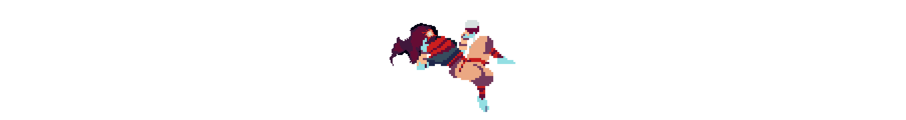
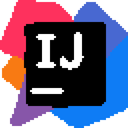
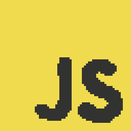
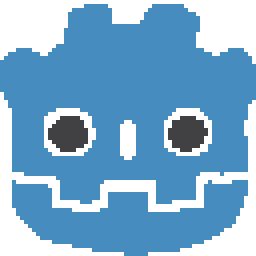
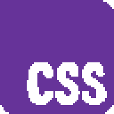
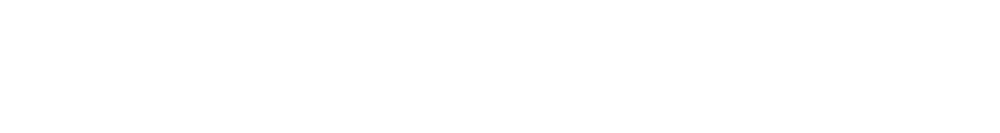

  
   
  <h3>i'm <b>Juan</b>, 
  a computer science student passionate about creative coding 
  <em>(also exploring full-stack development)</em></h3>

   

 

  
    
        

  

  
    
  
    
  
     
  <a href="https://otijolo.github.io/portfolio/"><em>more about me</em></a>

